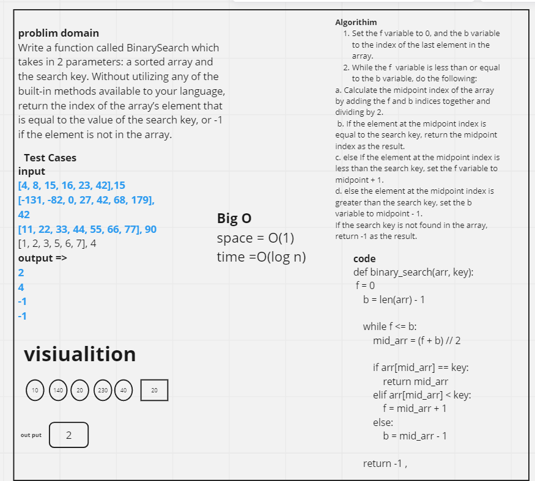

# code chaleng 3 (array-Binary)
<!-- Description of the challenge -->
Write a function called BinarySearch which takes in 2 parameters: a sorted array and the search key. Without utilizing any of the built-in methods available to your language, return the index of the array’s element that is equal to the value of the search key, or -1 if the element is not in the array.

## Whiteboard Process

## Approach & Efficiency
The binary search algorithm is an efficient algorithm for searching sorted arrays. The algorithm follows a divide-and-conquer approach where it repeatedly divides the search interval in half until the search key is found or it is determined that the key is not in the array.

The algorithm has a time complexity of O(log n), where n is the size of the input array. This is because the algorithm divides the search space in half with each iteration, leading to a logarithmic time complexity. This is much faster than a linear search, which would have a time complexity of O(n) in the worst case.

The space complexity of the binary search algorithm is O(1), which means that it uses a constant amount of extra space regardless of the size of the input array. This is because the algorithm only uses a few variables to keep track of the indices of the search interval, and does not create any additional data structures.

Overall, the binary search algorithm is a very efficient algorithm for searching sorted arrays. It has a time complexity of O(log n) and a space complexity of O(1), making it a good choice for large arrays where efficiency is important.

## Solution

def binary_search(arr, key):
 f = 0
    b = len(arr) - 1

    while f <= b:
        mid_arr = (f + b) // 2

        if arr[mid_arr] == key:
            return mid_arr
        elif arr[mid_arr] < key:
            f = mid_arr + 1
        else:
            b = mid_arr - 1

    return -1 ,