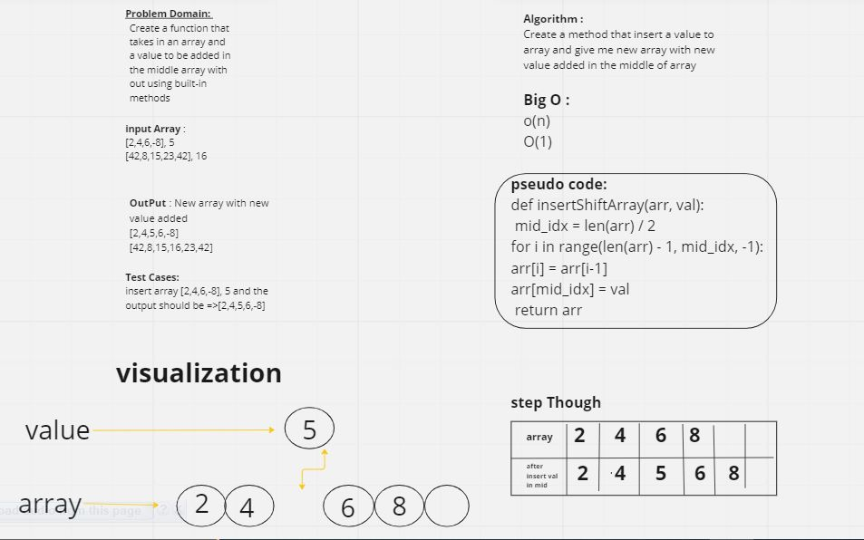

# code chaleng 2 (array-insert-shift)
<!-- Description of the challenge -->
create a method that insert a value to the array that i have & give me a new array that have the new value but the value should be in the middle of this array 

## Whiteboard Process

## Approach & Efficiency
The function takes an input array arr and an input value value, and inserts the value at the middle index of the array. To do this, it creates a new array new_arr of length n+1 where n is the length of arr. It then copies the first half of the elements of arr to new_arr, inserts the input value at the middle index, and copies the second half of the elements of arr to new_arr. Finally, it returns the new array new_arr.

This function has a time complexity of O(n), where n is the length of the input array, because it loops through the input array twice. The space complexity is also O(n), because it creates a new array of length n+1.

## Solution

def insertShiftArray(arr,val):
    mid_idx =len(arr)//2
    for i in range(len(arr)-1 , mid_idx -1):
    arr[i] = arr[i-1]
    arr[mid_idx]= val
return arr
(to run the code i should use (python the name of myfile.py) )