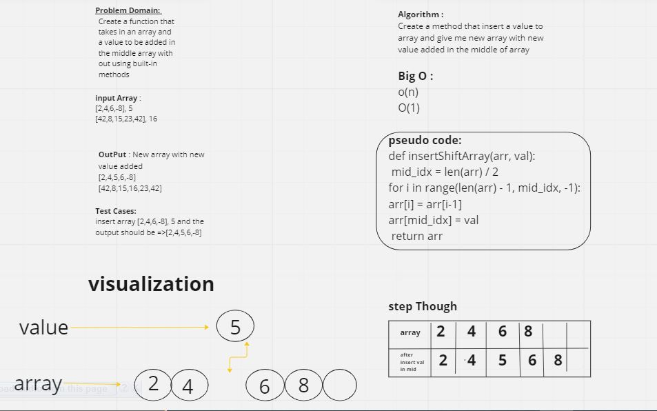

# code chaleng 2 (array-insert-shift)
<!-- Description of the challenge -->
create a method that insert a value to the array that i have & give me a new array that have the new value but the value should be in the middle of this array 

  
## Whiteboard Process

## Approach & Efficiency
i use for loop 

## Solution

def insertShiftArray(arr,val):
    mid_idx =len(arr)/2
    for i in range(len(arr)-1 , mid_idx -1):
    arr[i] = arr[i-1]
    arr[mid_idx]= val
return arr
(to run the code i should use 
(python the name of myfile.py) )