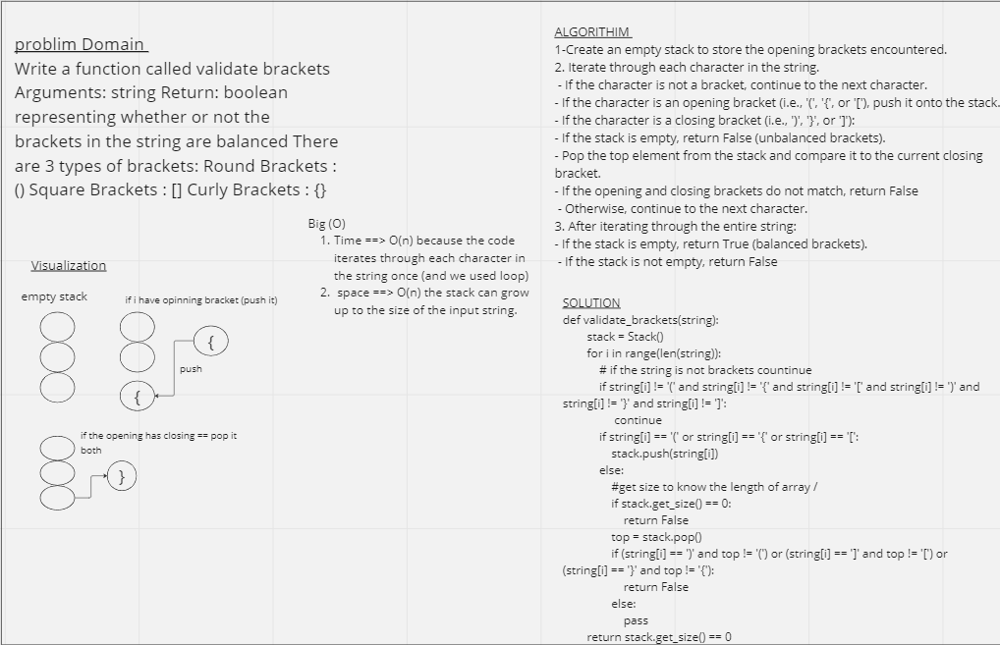

# stack_queue_brackets 
Write a function called validate brackets
Arguments: string
Return: boolean
representing whether or not the brackets in the string are balanced
There are 3 types of brackets:

Round Brackets : ()
Square Brackets : []
Curly Brackets : {}

## Approach & Efficiency
big(o)
> - Time --> O(n) 
> - space -->O(n)

## Whiteboard Process links

### solution 

def validate_brackets(string):
        """Check if the brackets in the given string are balanced"""
        stack = Stack()

        for i in range(len(string)):
            # if the string is not brackets countinue
            if string[i] != '(' and string[i] != '{' and string[i] != '[' and string[i] != ')' and string[i] != '}' and string[i] != ']':
                 continue
            
            if string[i] == '(' or string[i] == '{' or string[i] == '[':
                stack.push(string[i])

            else:
                #get size to know the length of array / 
                if stack.get_size() == 0:
                    return False
                
                top = stack.pop()
                if (string[i] == ')' and top != '(') or (string[i] == ']' and top != '[') or (string[i] == '}' and top != '{'):
                    return False
                else:
                    pass 
        return stack.get_size() == 0

'''
# str= ({[ abc ]})

will enter the str and loop for each element(index) if he found a character he will countinue(skip) to next character 

if he found a opening bracets he will push it to the empty stack 
therid --> top [
secound {
first (

- else if he found a closing bracets he will return back to stack :   he will check first if it was empty stack (by the size (length) of it ) will return false 

then we ill declare a variable to delete the top from stack 
then we will check :
// if the index(bracket) was closing and the top was not opening(bracket) return false 
// else return True

'''