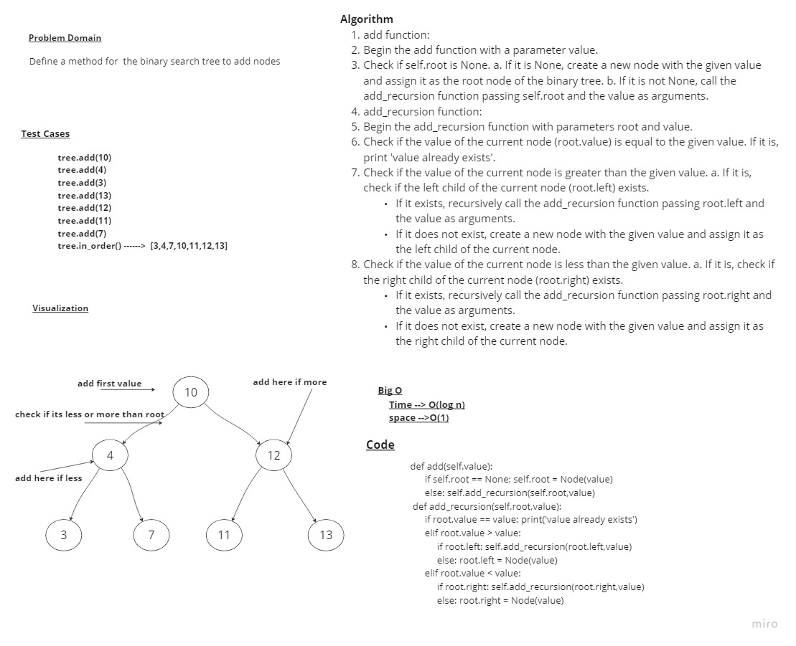
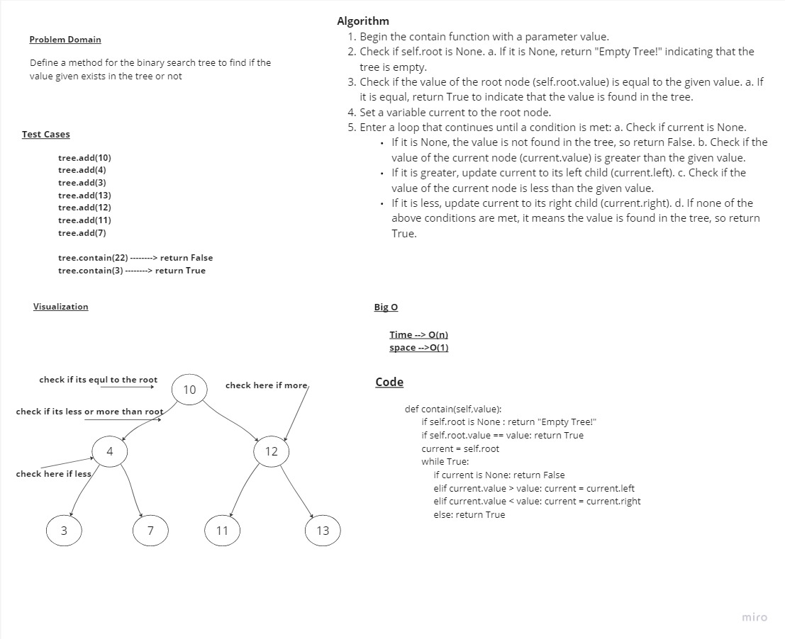

# Trees

## Whiteboard Process links

## Approach & Efficiency
Time --> O(log n) , O(n) check whiteboard for more info
space -->O(1) , O(n) check whiteboard for more info

## Solution
class BinaryTree :
    
    def __init__(self):
        self.root = None

    def pre_order(self,root,list1 = None):
        if list1 == None :
            list1 = []
        if self.root is None :
            return []
        if root is not None:
            list1.append(root.value) 
        # if root.left is not None:
            self.pre_order(root.left,list1)
        # if root.right is not None:
            self.pre_order(root.right,list1)
        return list1   
      
                  

    def in_order(self,root,list2=None):
        if list2 == None :
            list2 = []
        
        if root.left is not None:
           self.in_order(root.left,list2)    
        if root is not None:
            list2.append((root.value)) 
        if root.right is not None:
            self.in_order(root.right,list2)   
        return list2
    
    def post_order(self,root,list3=None):
        if list3 == None :
            list3 = []
        if root.left is not None:
            self.post_order(root.left,list3)    
        if root.right is not None:
            self.post_order(root.right,list3)        
        if root is not None:
            list3.append(root.value) 
        return list3     

     def max_val(self):
    
        max= self.root.value
        
        if self.root is None :
            return "Empty Tree"   
        
        in_ord= self.in_order(self.root)
        for i in range(len(in_ord)):                
            if in_ord[i] > max:
                max = in_ord[i]
                
        return max  

    def breadth_first(self,node):
        queue= Queue()
        list_breadth = []
        
        if node is None :
            return []
        else:
            queue.enqueue(node)
        while queue.front:
            node = queue.dequeue()
            list_breadth.append(node.value)
            if node.left :
                queue.enqueue(node.left)
            if node.right:
                queue.enqueue(node.rigth)    
        return list_breadth    

class BST(BinaryTree):
    def __init__(self):
        self.root = None

    def add(self, root, value):
        if root is None:
            self.root = Node(value)
        else:
            if root.value < value:
                if root.right is None:
                    root.right = Node(value)
                else:
                    self.add(root.right, value)
            else:
                if root.left is None:
                    root.left = Node(value)
                else:
                    self.add(root.left, value)

    def contains(self, value, nodes):
        if nodes is None:
            return False
        elif nodes.value == value:
            return True
        elif nodes.value > value:
            return self.contains(value, nodes.left)
        else:
            return self.contains(value, nodes.right)
